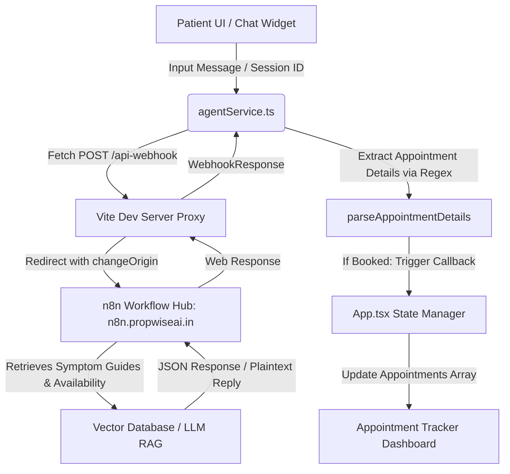

# 🏥 HMS Clinic Portal: Healthcare RAG & Appointment Booking Agent

An intelligent, state-of-the-art Patient Portal designed to assist patients in medical symptom analysis and automated clinical scheduling. The interface connects to a self-hosted **n8n Healthcare RAG Webhook** to retrieve doctor details and automatically books appointments using custom client-side parsing.

---

## 🚀 Key Features

*   **RAG Symptom Analyzer:** Real-time symptom checks powered by Retreival-Augmented Generation (RAG) referencing clinical guides and medical literature databases via n8n.
*   **Instant AI Appointment Booking:** Book appointments through natural conversation. The AI parses schedules dynamically and inserts bookings into the tracker.
*   **Dynamic Doctor Selection Catalog:** Interactive cards showcasing hospital specialists, their credentials, and quick-actions to prepopulate chat prompts.
*   **Live Patient Appointment Tracker Dashboard:** Direct client-side widget to track active appointments, view schedules (date, time, doctor, specialty), and cancel slot allocations dynamically.
*   **Premium Glassmorphic Design:** Handcrafted styling including custom smooth transitions, glowing state indicators for live-system health checkups, and absolute responsive layout structures.

---

## 🛠️ Technology Stack

*   **Frontend Library:** [React 19](https://react.dev/)
*   **Development Server:** [Vite 8](https://vite.dev/)
*   **Language:** [TypeScript](https://www.typescriptlang.org/)
*   **Icons:** [Lucide React](https://lucide.dev/)
*   **Styling:** Custom Native CSS variables with custom fonts:
    *   *Sans-serif (UI):* [Plus Jakarta Sans](https://fonts.google.com/specimen/Plus+Jakarta+Sans)
    *   *Monospace (Headers):* [Space Grotesk](https://fonts.google.com/specimen/Space+Grotesk)

---

## 🗺️ System Architecture



---

## 📂 Project Structure

```bash
Rag_healthcare/
├── src/
│   ├── assets/             # Static Assets (Images, Logos)
│   ├── components/         # UI Elements
│   │   ├── AppointmentTracker.tsx  # Dynamic list of patient bookings
│   │   ├── ChatWidget.tsx          # Floating drawer with messaging UI & RAG query handling
│   │   ├── DoctorList.tsx          # Catalog of clinical specialists
│   │   ├── Header.tsx              # Portal navigation and n8n network connectivity indicator
│   │   └── Hero.tsx                # Welcome banner with interactive FAQs
│   ├── services/
│   │   └── agentService.ts # Communicates with n8n webhook and parses incoming dates/times/doctors
│   ├── App.tsx             # Main dashboard assembly and core state coordinator
│   ├── index.css           # Base styles, color tokens, and custom keyframe animations
│   └── main.tsx            # Application entry point
├── vite.config.ts          # Vite configuration & dev server proxy maps
├── tsconfig.json           # TypeScript configuration
└── package.json            # Node dependencies and build script aliases
```

---

## 🌐 Webhook & Proxy Configuration

To prevent CORS issues during local development, Vite serves as a local proxy redirecting web API requests to the remote n8n instance:

```typescript
// vite.config.ts
export default defineConfig({
  plugins: [react()],
  server: {
    proxy: {
      '/api-webhook': {
        target: 'https://n8n.propwiseai.in',
        changeOrigin: true,
        rewrite: (path) => path.replace(/^\/api-webhook/, '')
      }
    }
  }
})
```

*   **Vite Target Path:** `/api-webhook`
*   **Webhook Endpoint:** `/webhook/e69a53ea-9a80-48ab-854b-e5e5f99eba26`
*   **Full proxied request URL:** `https://n8n.propwiseai.in/webhook/e69a53ea-9a80-48ab-854b-e5e5f99eba26`

---

## 🎨 Theme Tokens & Design Palette

The application uses standard CSS variables located in `src/index.css` for simple customization:

| CSS Token | Color Hex / Value | Usage |
| :--- | :--- | :--- |
| `--bg-primary` | `#f4f7fa` | Dashboard background color |
| `--bg-secondary` | `#ffffff` | Panel backgrounds & containers |
| `--accent-cyan` | `#0284c7` | Highlight color and primary brand accents |
| `--accent-teal` | `#0f766e` | Secondary healthcare/clinical accents |
| `--accent-rose` | `#be123c` | Urgent alerts / cancellations |
| `--accent-emerald`| `#047857` | Confirmed events |
| `--glass-border` | `rgba(15, 118, 110, 0.12)` | Hospital panels & card borders |

---

## 🏃 Getting Started

### Prerequisites

Ensure you have [Node.js](https://nodejs.org/) installed (v18 or higher recommended).

### 1. Install Dependencies
```bash
npm install
```

### 2. Launch the Local Development Server
```bash
npm run dev
```
Open your browser and navigate to the local link (typically `http://localhost:5173/`).

### 3. Build for Production
To bundle assets and optimize for production deployments:
```bash
npm run build
```

### 4. Preview Build
To run a local web server displaying the built production bundle:
```bash
npm run preview
```

---

## ⚙️ Configuration & Customization

### Webhook Connection Check
On application launch, `App.tsx` triggers a background connectivity check against `https://n8n.propwiseai.in` to test access:
*   A green indicator in the header (**"CONNECTED"**) confirms a successful handshake.
*   If offline, a warning badge is shown, and the application gracefully falls back to clear warnings about configuration.

### Parsing Details
The regex parsing in `src/services/agentService.ts` automatically extracts dates, times, and doctor names (looking for the prefix `Dr. <Name>`) to add to the dashboard. If your LLM/n8n response format shifts, you can refine `parseAppointmentDetails()` to align with new string templates.
